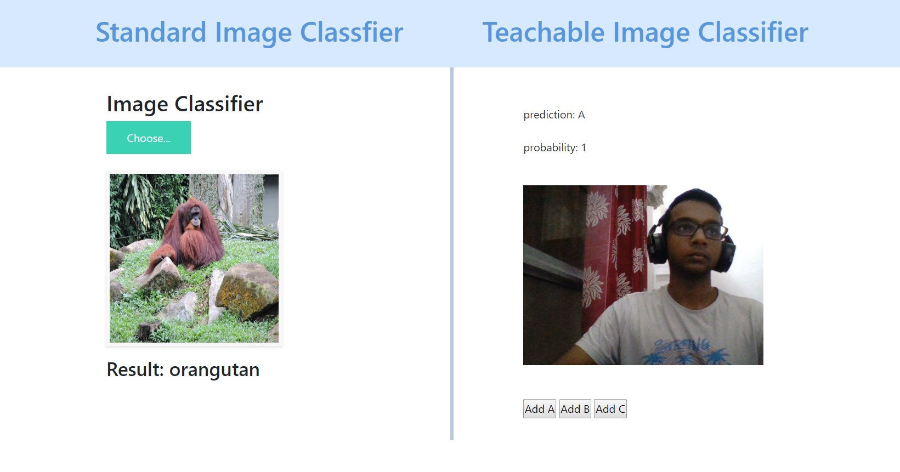

# Image-Classifier-TensorflowJS

## Brief:
This is a web app which can classify images which are trained on ResNet50 keras model with imagenet as its weights.
Not only this, you can even train machine on your own training images using webcam. Teachable machine is deployed using mobilenet pretrained weights using tensorflowjs. Flask has been used as a backend tool for web deployment.

## Screenshot:


## Run with python
Follow these steps to run the web application. You can also create an environment using conda or virtualenv first to run: -

1. Clone the repo.

```sh
git clone https://github.com/HimanshuMittal01/Image-Classifier-TensorflowJS.git
```

2. Install all the dependencies

```sh
pip install -r requirements.txt
```

3. Run the app

```sh
flask run
```
